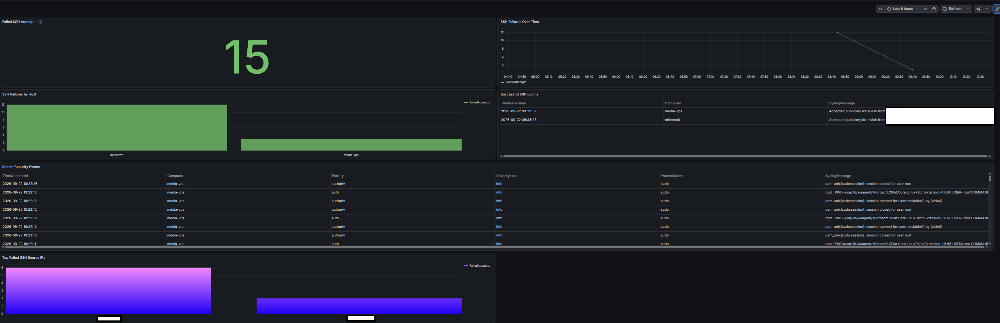

# Hybrid Security Monitoring

This document describes the centralized security-monitoring architecture used by the homelab.

The environment combines Azure Arc, Azure Monitor Agent, Log Analytics, KQL detections, Azure Monitor alerts, and Grafana to collect and visualize authentication activity from Linux systems that are not hosted directly in Azure.

The goal is to provide a practical hybrid-cloud security monitoring pipeline while keeping administrative access private and avoiding stored Azure application credentials.

## Architecture

```text
                  Hybrid Linux Hosts
                /                    \
               /                      \
        minecraft                    media-vps
         On-Prem                    Interserver
            |                            |
            +--------- Azure Arc --------+
                         |
                         v
                Azure Monitor Agent
                         |
                         v
                Data Collection Rule
                         |
                         v
                  Log Analytics
                         |
              +----------+----------+
              |                     |
              v                     v
          Grafana               KQL Detection
       visualization                 |
                                      v
                             Azure Monitor Alert
                                      |
                                      v
                                Action Group
                                      |
                                      v
                              Email Notification
```

The monitoring pipeline separates collection, storage, detection, alerting, and visualization into distinct components.

## Monitored Systems

The current security telemetry sources are:

- `minecraft` - on-premises Linux game server
- `media-vps` - externally hosted Linux media server

Both systems are connected to Azure through Azure Arc.

The hosts themselves are not provisioned by this Terraform project. The repository manages the Azure-side monitoring configuration and Data Collection Rule associations.

## Azure Monitor Agent

Azure Monitor Agent is installed on the Arc-enabled Linux systems.

The agent forwards selected Linux Syslog events to Azure using a Terraform-managed Data Collection Rule.

Only authentication-related facilities are collected for the current security use case:

```text
auth
authpriv
```

All severity levels within those facilities are collected.

This provides authentication telemetry without forwarding every Syslog facility generated by the hosts.

## Data Collection Rule

The security Data Collection Rule is managed in Terraform as:

```text
dcr-hmlb-linux-security
```

The rule collects:

```text
Microsoft-Syslog
```

from the following facilities:

```text
auth
authpriv
```

The data is sent to the dedicated Log Analytics workspace used for homelab security monitoring.

The Data Collection Rule is associated with both:

```text
minecraft
media-vps
```

through Azure Arc resource IDs.

## Log Analytics

Collected authentication events are centralized in the Log Analytics workspace:

```text
law-hmlb-sec
```

The workspace currently uses:

```text
SKU:       PerGB2018
Retention: 30 days
```

Log Analytics serves as the central query and detection layer for the environment.

Security events can be queried directly with KQL and are also consumed by Grafana through the Azure Monitor data source.

## SSH Brute-Force Detection

The first implemented detection identifies repeated failed SSH authentication attempts.

The detection runs as an Azure Monitor scheduled-query alert.

### Detection Logic

```kusto
Syslog
| where ProcessName startswith "sshd"
| where SyslogMessage has_any (
    "Failed password",
    "Failed publickey",
    "Invalid user",
    "authentication failure"
)
| summarize FailedAttempts = count() by Computer
```

Using:

```kusto
ProcessName startswith "sshd"
```

instead of checking only for an exact `sshd` process name allows the query to match Linux distributions that log SSH activity using related process names such as `sshd-session`.

### Alert Threshold

The current alert evaluates:

```text
Evaluation frequency: 1 minute
Detection window:     5 minutes
Threshold:            5 failed attempts
Aggregation:          Maximum
Dimension:            Computer
Severity:             2
```

This causes each monitored system to be evaluated independently.

If a host generates five or more matching failed authentication events within the evaluation window, the alert condition is met.

## Alert Notification

Alert notifications are delivered through the Terraform-managed Azure Monitor Action Group:

```text
ag-hmlb-security
```

The notification receiver is configured using a Terraform variable:

```hcl
variable "alert_email" {
  description = "Email address for Azure security alert notifications"
  type        = string
  sensitive   = true
}
```

The actual email address is not stored in the repository.

For local Terraform operations it can be supplied through:

```powershell
$env:TF_VAR_alert_email = "your-alert-address@example.com"
```

Terraform state may contain sensitive values and is intentionally excluded from Git.

## Grafana Integration

Grafana runs on the Azure utility VM:

```text
vm-hmlb-util
```

The Grafana container remains bound to:

```text
127.0.0.1:3000
```

and is not directly exposed to the public Internet.

Authorized tailnet clients access Grafana through Tailscale Serve.

## Managed Identity Authentication

Grafana accesses Azure Monitor using the utility VM's system-assigned managed identity.

This avoids storing an Azure client secret, service-principal password, or application credential inside Grafana.

The managed identity receives:

```text
Log Analytics Data Reader
```

on the security Log Analytics workspace.

It also receives:

```text
Reader
```

at the Azure subscription scope so Grafana can discover the Azure monitoring resources required by the Azure Monitor data source.

The resulting authentication path is:

```text
Grafana
   |
   v
Azure VM system-assigned managed identity
   |
   v
Azure RBAC
   |
   v
Azure Monitor / Log Analytics
```

## Grafana Security Dashboard

The Grafana dashboard provides a consolidated view of authentication activity across the monitored Linux systems.

Current panels include:

- failed SSH authentication attempts
- SSH failures over time
- SSH failures by host
- top failed SSH source addresses
- successful SSH logins
- sudo activity
- recent authentication and security events

Example dashboard:



### Failed SSH Attempts

Example KQL:

```kusto
Syslog
| where $__timeFilter(TimeGenerated)
| where ProcessName startswith "sshd"
| where SyslogMessage has_any (
    "Failed password",
    "Failed publickey",
    "Invalid user",
    "authentication failure"
)
| summarize FailedAttempts=count()
```

### SSH Failures Over Time

```kusto
Syslog
| where $__timeFilter(TimeGenerated)
| where ProcessName startswith "sshd"
| where SyslogMessage has_any (
    "Failed password",
    "Failed publickey",
    "Invalid user",
    "authentication failure"
)
| summarize FailedAttempts=count() by bin(TimeGenerated, $__interval)
| order by TimeGenerated asc
```

### SSH Failures by Host

```kusto
Syslog
| where $__timeFilter(TimeGenerated)
| where ProcessName startswith "sshd"
| where SyslogMessage has_any (
    "Failed password",
    "Failed publickey",
    "Invalid user",
    "authentication failure"
)
| summarize FailedAttempts=count() by Computer
| order by FailedAttempts desc
```

### Successful SSH Logins

```kusto
Syslog
| where $__timeFilter(TimeGenerated)
| where ProcessName startswith "sshd"
| where SyslogMessage startswith "Accepted"
| project TimeGenerated, Computer, SyslogMessage
| order by TimeGenerated desc
```

### Sudo Activity

```kusto
Syslog
| where $__timeFilter(TimeGenerated)
| where ProcessName == "sudo"
| where Facility == "auth"
| project TimeGenerated, Computer, SyslogMessage
| order by TimeGenerated desc
```

### Recent Security Events

```kusto
Syslog
| where $__timeFilter(TimeGenerated)
| where Facility in ("auth", "authpriv")
| project TimeGenerated, Computer, Facility, SeverityLevel, ProcessName, SyslogMessage
| order by TimeGenerated desc
| take 100
```

### Top Failed SSH Source Addresses

```kusto
Syslog
| where $__timeFilter(TimeGenerated)
| where ProcessName startswith "sshd"
| where SyslogMessage has_any (
    "Failed password",
    "Failed publickey",
    "Invalid user",
    "authentication failure"
)
| extend SourceIP = extract(@"from\s+([^\s]+)", 1, SyslogMessage)
| where isnotempty(SourceIP)
| summarize FailedAttempts=count() by SourceIP, Computer
| order by FailedAttempts desc
| take 10
```

## End-to-End Validation

The monitoring pipeline was tested by deliberately generating failed SSH authentication attempts against a monitored host.

The validation confirmed each stage of the pipeline:

```text
Failed SSH authentication
        |
        v
Linux Syslog
        |
        v
Azure Monitor Agent
        |
        v
Data Collection Rule
        |
        v
Log Analytics
        |
        v
KQL detection
        |
        v
Azure Monitor scheduled-query alert
        |
        v
Action Group
        |
        v
Email notification
```

The same events were also visible in the Grafana dashboard through the Azure Monitor data source.

A separate test event was generated with:

```bash
logger -p authpriv.warning "AMA_TEST minecraft authpriv security event"
```

and was successfully observed in Log Analytics.

This provided confirmation that the authentication Syslog facility was being collected and routed correctly before testing the alert logic.

## Security Design Decisions

Several design decisions were made to reduce unnecessary exposure.

### Grafana is not public

Grafana remains bound to the loopback interface.

External administrative access is provided through Tailscale rather than exposing Grafana directly through a public reverse proxy.

### Azure credentials are not stored in Grafana

The Azure Monitor data source uses the utility VM's system-assigned managed identity.

No Azure client secret is required.

### Log access is read-only

Grafana receives read-only Azure permissions required to query monitoring data.

It does not receive write access to the Log Analytics workspace.

### Authentication telemetry is centralized

Authentication events from externally hosted systems are stored in Azure rather than relying only on local log files.

This allows events to remain queryable even when administrators are not connected directly to the host.

### Alert configuration is Infrastructure as Code

The Log Analytics workspace, Data Collection Rule, Arc associations, RBAC assignments, Action Group, and scheduled-query alert are defined in Terraform.

This keeps the security-monitoring configuration version-controlled and reproducible.

## Terraform Resources

The Azure-side monitoring configuration is defined in:

```text
terraform/azure/monitoring.tf
```

Major resources include:

```text
azurerm_log_analytics_workspace
azurerm_monitor_data_collection_rule
azurerm_monitor_data_collection_rule_association
azurerm_role_assignment
azurerm_monitor_action_group
azurerm_monitor_scheduled_query_rules_alert_v2
```

## Current Limitations

The security-monitoring implementation is intentionally small and focused.

Current limitations include:

- Azure Arc enrollment itself is not yet automated by this repository
- Azure Monitor Agent lifecycle is not fully managed by this Terraform configuration
- Grafana Azure Monitor datasource provisioning is not yet fully codified in the repository
- Tailscale Serve configuration is not yet managed by Ansible
- the alerting catalog currently focuses on SSH authentication failures
- the environment does not currently use Microsoft Sentinel
- Terraform state remains local

These limitations are tracked as potential future improvements rather than being hidden from the project documentation.

## Future Detection Ideas

Potential additions include:

- repeated sudo authentication failures
- unusual root login activity
- SSH login activity from unexpected networks
- repeated invalid-user attempts
- authentication spikes by source address
- service failures correlated with authentication activity
- changes to privileged groups
- SSH configuration changes
- unexpected account creation
- suspicious scheduled-task or cron changes

The goal is to add detections when they provide useful signal rather than adding rules solely to increase the number of dashboard panels or alerts.